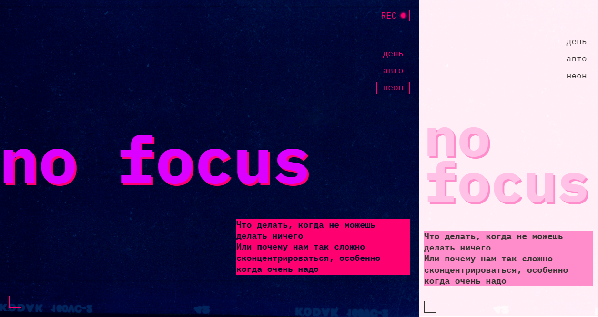

# Сайт статьи «Сложно сосредоточиться»

«Сложно сосредоточиться» – это одностраничный адаптивный сайт, на котором размещена статья о проблемах концентрации внимания. Статья разделена на текстовые и графические блоки, пользователи могут переключаться между светлой и темной темами.

Целью проекта является освоение методов адаптивной и резиновой верстки, включая подходы mobile и desktop first, а также применение CSS-переменных для создания тем. В работе используются CSS-функции и относительные единицы измерения, а для переключения тем применяется JavaScript. Проект направлен на закрепление навыков верстки со стилизацией тем.

[Сайт на github-pages](https://anna-kobis.github.io/slozhno-sosredotochitsya/) | [Макет в Figma](https://www.figma.com/design/lCqDbWjgllgJtb2hmCqfyX/)

## Стек технологий

- Верстка на HTML5 и CSS3.
- Скрипты на JavaScript (ES6+).
